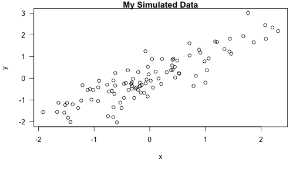

# My first knitr Document
Shovit R. Bhari

## Inroduction

This is some text (i.e. a "text chunk"). Here is a code chunk. 


### Inline Text Computations


The current time is Tue Jun 30 10:32:30 20. My favorite random number is -0.6203667.

Let's first simulate some data. 


```r
x <- rnorm(100); y <- x + rnorm(100, sd=0.5)
```

Here is a scatterplot of the data. 


```r
par(mar=c(5,4,1,1), las=1)
plot(x,y, main="My Simulated Data")
```



# Making Tables with xtable

##Introduction


```r
library(datasets)
data(airquality)
fit <- lm(Ozone~Wind + Solar.R + Temp, data=airquality)
```

Here is a table of regression coefficients. 


```r
library(xtable)
xt <- xtable(summary(fit))
print(xt, type="html")
```

<!-- html table generated in R 3.6.3 by xtable 1.8-4 package -->
<!-- Tue Jun 30 10:32:30 2020 -->
<table border=1>
<tr> <th>  </th> <th> Estimate </th> <th> Std. Error </th> <th> t value </th> <th> Pr(&gt;|t|) </th>  </tr>
  <tr> <td align="right"> (Intercept) </td> <td align="right"> -64.3421 </td> <td align="right"> 23.0547 </td> <td align="right"> -2.79 </td> <td align="right"> 0.0062 </td> </tr>
  <tr> <td align="right"> Wind </td> <td align="right"> -3.3336 </td> <td align="right"> 0.6544 </td> <td align="right"> -5.09 </td> <td align="right"> 0.0000 </td> </tr>
  <tr> <td align="right"> Solar.R </td> <td align="right"> 0.0598 </td> <td align="right"> 0.0232 </td> <td align="right"> 2.58 </td> <td align="right"> 0.0112 </td> </tr>
  <tr> <td align="right"> Temp </td> <td align="right"> 1.6521 </td> <td align="right"> 0.2535 </td> <td align="right"> 6.52 </td> <td align="right"> 0.0000 </td> </tr>
   </table>

