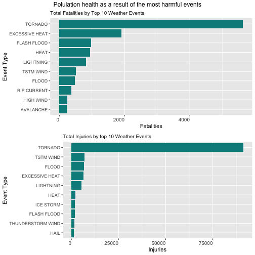
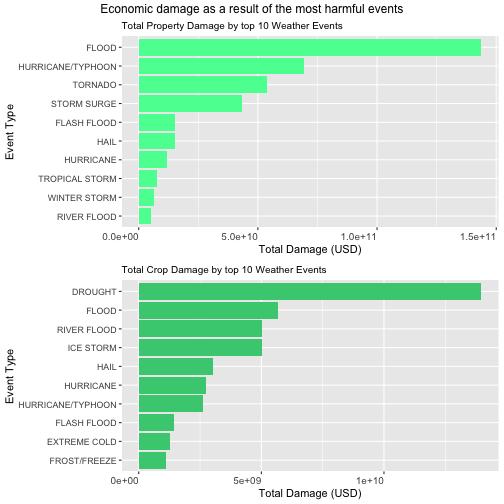

---
title: "NOAA Storm Data"
author: "Shovit Bhari"
date: 2020-05-07
output: 
    pdf_document:
        keep_tex: true
    html_document:
---


# 1. Synopsis

Conduction of this analysis was a part of Coursera Reproducible Research(Assignment 2), this course is a part of Data Science Specialization. This project involves exploring the U.S. National Oceanic and Atmospheric Administration's NOAA Storm Database and its consequences on both population health and the economy.  The [data]( https://d396qusza40orc.cloudfront.net/repdata%2Fdata%2FStormData.csv.bz2 ) analyzed tracked characteristics of significant storms and weather events in the United States covered between the years 1950 and November 2011. In the earlier years of the database, there are generally fewer events recorded, most likely due to a lack of proper records. More recent years should be considered complete. 

This analysis investigates the top severe weather events that were most harmful to the population health in terms of fatalities and injuries. In addition, the economic consequence was analyzed by exploring financial damages on properties and crops. 

Here are results of the top severe weather events that cause the most damages:  

* Fatalities: Tornado   
* Injuries: Tornado   
* Property Damages: Flood  
* Crop Damages: Drought  


# 2. Data Processing

##### 2.1.1 Downloading Data
Download the data from the link provided above. Unzips the data if data has not been downloaded to the local computer.  

```r
library(R.utils)
if(!file.exists("./data")){dir.create("./data")}
url <-("https://d396qusza40orc.cloudfront.net/repdata%2Fdata%2FStormData.csv.bz2")
filepath <- "./data/StormData.csv.bz2"
download.file (url, filepath)
if(!file.exists("./data/StormData.csv"))
   {bunzip2("./data/StormData.csv.bz2", "./data/StormData.csv")}
```
##### 2.1.2 Loading Libraries
All the required libraries are loaded. 

```r
library(ggplot2)
library(dplyr)
library(gridExtra)
library(formattable)
```

##### 2.1.3 Reading Data
Read the data and assign it to the data frame. 

```r
data <- read.csv("./data/StormData.csv")
```

##### 2.2 Creating a subset
Not all the variables are required for analysis so we have to select only the required variables. 


```r
storm_data <- select(data, c("EVTYPE","FATALITIES","INJURIES","PROPDMG", "PROPDMGEXP","CROPDMG","CROPDMGEXP")) 
```
##### 2.3.1 Health Consequences (Fatalities)
Arrange the fatalities and take a sum by the event type. This provides us the sum of fatalities caused by different events. 

```r
Fatalities <- aggregate(FATALITIES~EVTYPE, data=storm_data, sum)
top10_fatalities<- Fatalities %>% arrange(desc(FATALITIES)) %>%
        top_n(10)
```
##### 2.3.2 Health Consequences (Injuries)
Arrange the injuries and take a sum by the event type. This provides us the sum of injuries caused by different events.

```r
Injuries <- aggregate(INJURIES~EVTYPE, data=storm_data, sum)
top10_injuries<- Injuries %>% arrange(desc(INJURIES)) %>%
        top_n(10)
```
##### 2.4.1 Checking the unique values of Property Damage Exponents
Property Damage Exponent values in the dataset is assigned as symbols of "SI Units" which needs to be identified. 

```r
unique(storm_data$PROPDMGEXP)
```

```
##  [1] K M   B m + 0 5 6 ? 4 2 3 h 7 H - 1 8
## Levels:  - ? + 0 1 2 3 4 5 6 7 8 B h H K m M
```
##### 2.4.2 Assiging the required values to the exponents. 
Numerical values are assigned to each unique symbols based on their "SI Units" . [Wikipedia Power of 10](https://en.wikipedia.org/wiki/Power_of_10)

```r
# Assigning values for the property exponent strmdata 
storm_data$PROPEXP[storm_data$PROPDMGEXP == "M"] <- 1e+06
storm_data$PROPEXP[storm_data$PROPDMGEXP == ""] <- 1
storm_data$PROPEXP[storm_data$PROPDMGEXP == "B"] <- 1e+09
storm_data$PROPEXP[storm_data$PROPDMGEXP == "m"] <- 1e+06
storm_data$PROPEXP[storm_data$PROPDMGEXP == "0"] <- 1
storm_data$PROPEXP[storm_data$PROPDMGEXP == "5"] <- 1e+05
storm_data$PROPEXP[storm_data$PROPDMGEXP == "6"] <- 1e+06
storm_data$PROPEXP[storm_data$PROPDMGEXP == "4"] <- 10000
storm_data$PROPEXP[storm_data$PROPDMGEXP == "2"] <- 100
storm_data$PROPEXP[storm_data$PROPDMGEXP == "3"] <- 1000
storm_data$PROPEXP[storm_data$PROPDMGEXP == "h"] <- 100
storm_data$PROPEXP[storm_data$PROPDMGEXP == "7"] <- 1e+07
storm_data$PROPEXP[storm_data$PROPDMGEXP == "H"] <- 100
storm_data$PROPEXP[storm_data$PROPDMGEXP == "1"] <- 10
storm_data$PROPEXP[storm_data$PROPDMGEXP == "8"] <- 1e+08

# Assigning '0' to invalid exponent strmdata
storm_data$PROPEXP[storm_data$PROPDMGEXP %in% c("+", "-", "?", "")] <- 0
```
##### 2.4.3 Calculating the total property damage value
Property damage value is a product of variables PROPDMG and PROPEXP

```r
storm_data$PROPDMGVAL <- storm_data$PROPDMG * storm_data$PROPEXP
```
##### 2.5.1 Checking the unique values of Crop Damage Exponents
Crop Damage Exponent values in the dataset is assigned as symbols of "SI Units" which needs to be identified. 

```r
unique(storm_data$CROPDMGEXP)
```

```
## [1]   M K m B ? 0 k 2
## Levels:  ? 0 2 B k K m M
```
##### 2.5.2 Assiging the required values to the exponents. 
Numerical values are assigned to each unique symbols based on their "SI Units" . [Wikipedia Power of 10](https://en.wikipedia.org/wiki/Power_of_10)

```r
# Assigning values for the crop exponent strmdata 
storm_data$CROPEXP[storm_data$CROPDMGEXP == "M"] <- 1e+06
storm_data$CROPEXP[storm_data$CROPDMGEXP == "K"] <- 1000
storm_data$CROPEXP[storm_data$CROPDMGEXP == "m"] <- 1e+06
storm_data$CROPEXP[storm_data$CROPDMGEXP == "B"] <- 1e+09
storm_data$CROPEXP[storm_data$CROPDMGEXP == "0"] <- 1
storm_data$CROPEXP[storm_data$CROPDMGEXP == "k"] <- 1000
storm_data$CROPEXP[storm_data$CROPDMGEXP == "2"] <- 100
storm_data$CROPEXP[storm_data$CROPDMGEXP == ""] <- 1

# Assigning '0' to invalid exponent strmdata
storm_data$CROPEXP[storm_data$CROPDMGEXP %in% c(""," ?")] <- 0
```
##### 2.5.3 Calculating the total crop damage value
Crop damage value is a product of variables CROPDMG and CROPEXP

```r
# calculating the crop damage 
storm_data$CROPDMGVAL <- storm_data$CROPDMG * storm_data$CROPEXP
```
#### 2.6.1 Ecomonic Consequences (Property Damages)
Arrange the property damages and take a sum by the event type. This provides us the sum of property damages in USD caused by different events.

```r
prop <- aggregate(PROPDMGVAL~EVTYPE,data=storm_data,FUN=sum,na.rm=TRUE)
top10_prop<- prop %>% arrange(desc(PROPDMGVAL)) %>%
        top_n(10)
```
#### 2.6.2 Economic Consequences (Crop Damages)
Arrange the crop damages and take a sum by the event type. This provides us the sum of crop  damages in USD caused by different events.

```r
crop <- aggregate(CROPDMGVAL~EVTYPE,data=storm_data,FUN=sum,na.rm=TRUE)
top10_crop<- crop %>% arrange(desc(CROPDMGVAL)) %>%
        top_n(10)
```
# 3. Results

#### 3.1.1 Top 10 Fatalities

```r
formattable(top10_fatalities)
```


<table class="table table-condensed">
 <thead>
  <tr>
   <th style="text-align:right;"> EVTYPE </th>
   <th style="text-align:right;"> FATALITIES </th>
  </tr>
 </thead>
<tbody>
  <tr>
   <td style="text-align:right;"> TORNADO </td>
   <td style="text-align:right;"> 5633 </td>
  </tr>
  <tr>
   <td style="text-align:right;"> EXCESSIVE HEAT </td>
   <td style="text-align:right;"> 1903 </td>
  </tr>
  <tr>
   <td style="text-align:right;"> FLASH FLOOD </td>
   <td style="text-align:right;"> 978 </td>
  </tr>
  <tr>
   <td style="text-align:right;"> HEAT </td>
   <td style="text-align:right;"> 937 </td>
  </tr>
  <tr>
   <td style="text-align:right;"> LIGHTNING </td>
   <td style="text-align:right;"> 816 </td>
  </tr>
  <tr>
   <td style="text-align:right;"> TSTM WIND </td>
   <td style="text-align:right;"> 504 </td>
  </tr>
  <tr>
   <td style="text-align:right;"> FLOOD </td>
   <td style="text-align:right;"> 470 </td>
  </tr>
  <tr>
   <td style="text-align:right;"> RIP CURRENT </td>
   <td style="text-align:right;"> 368 </td>
  </tr>
  <tr>
   <td style="text-align:right;"> HIGH WIND </td>
   <td style="text-align:right;"> 248 </td>
  </tr>
  <tr>
   <td style="text-align:right;"> AVALANCHE </td>
   <td style="text-align:right;"> 224 </td>
  </tr>
</tbody>
</table>
#### 3.1.2 Top 10 Injuries

```r
formattable(top10_injuries)
```


<table class="table table-condensed">
 <thead>
  <tr>
   <th style="text-align:right;"> EVTYPE </th>
   <th style="text-align:right;"> INJURIES </th>
  </tr>
 </thead>
<tbody>
  <tr>
   <td style="text-align:right;"> TORNADO </td>
   <td style="text-align:right;"> 91346 </td>
  </tr>
  <tr>
   <td style="text-align:right;"> TSTM WIND </td>
   <td style="text-align:right;"> 6957 </td>
  </tr>
  <tr>
   <td style="text-align:right;"> FLOOD </td>
   <td style="text-align:right;"> 6789 </td>
  </tr>
  <tr>
   <td style="text-align:right;"> EXCESSIVE HEAT </td>
   <td style="text-align:right;"> 6525 </td>
  </tr>
  <tr>
   <td style="text-align:right;"> LIGHTNING </td>
   <td style="text-align:right;"> 5230 </td>
  </tr>
  <tr>
   <td style="text-align:right;"> HEAT </td>
   <td style="text-align:right;"> 2100 </td>
  </tr>
  <tr>
   <td style="text-align:right;"> ICE STORM </td>
   <td style="text-align:right;"> 1975 </td>
  </tr>
  <tr>
   <td style="text-align:right;"> FLASH FLOOD </td>
   <td style="text-align:right;"> 1777 </td>
  </tr>
  <tr>
   <td style="text-align:right;"> THUNDERSTORM WIND </td>
   <td style="text-align:right;"> 1488 </td>
  </tr>
  <tr>
   <td style="text-align:right;"> HAIL </td>
   <td style="text-align:right;"> 1361 </td>
  </tr>
</tbody>
</table>
#### 3.1.3 Bar plot of fatalities and injuries as a result of top ten weather events in a descending order

```r
b1 <- ggplot(top10_fatalities, aes(x = reorder(EVTYPE, FATALITIES), FATALITIES, theme_set(theme_classic()))) + 
        geom_bar(stat = "identity", fill = "cyan4") + 
        theme(axis.text.x = element_text(angle = 0, hjust = 1, size = 10)) + 
        xlab("Event Type") + ylab("Fatalities") + ggtitle("Total Fatalities by Top 10 Weather Events") +
        theme(plot.title = element_text(size = 10)) + coord_flip()
```


```r
b2 <- ggplot(top10_injuries, aes(x =  reorder(EVTYPE, INJURIES), INJURIES, theme_set(theme_classic()))) + 
        geom_bar(stat = "identity", fill ="darkcyan") + 
        theme(axis.text.x = element_text(angle = 0, hjust = 1, size = 10))+
        xlab("Event Type") + ylab("Injuries") + ggtitle("Total Injuries by top 10 Weather Events") +
        theme(plot.title = element_text(size = 10)) + coord_flip()
```


```r
       grid.arrange(b1, b2, nrow = 2, top = "Polulation health as a result of the most harmful events")
```


#### 3.2.1 Top 10 Property Damages

```r
formattable(top10_prop)
```


<table class="table table-condensed">
 <thead>
  <tr>
   <th style="text-align:right;"> EVTYPE </th>
   <th style="text-align:right;"> PROPDMGVAL </th>
  </tr>
 </thead>
<tbody>
  <tr>
   <td style="text-align:right;"> FLOOD </td>
   <td style="text-align:right;"> 143779180000 </td>
  </tr>
  <tr>
   <td style="text-align:right;"> HURRICANE/TYPHOON </td>
   <td style="text-align:right;"> 69303870000 </td>
  </tr>
  <tr>
   <td style="text-align:right;"> TORNADO </td>
   <td style="text-align:right;"> 53783900134 </td>
  </tr>
  <tr>
   <td style="text-align:right;"> STORM SURGE </td>
   <td style="text-align:right;"> 43304930000 </td>
  </tr>
  <tr>
   <td style="text-align:right;"> FLASH FLOOD </td>
   <td style="text-align:right;"> 15416842262 </td>
  </tr>
  <tr>
   <td style="text-align:right;"> HAIL </td>
   <td style="text-align:right;"> 15060160736 </td>
  </tr>
  <tr>
   <td style="text-align:right;"> HURRICANE </td>
   <td style="text-align:right;"> 11858970000 </td>
  </tr>
  <tr>
   <td style="text-align:right;"> TROPICAL STORM </td>
   <td style="text-align:right;"> 7657980000 </td>
  </tr>
  <tr>
   <td style="text-align:right;"> WINTER STORM </td>
   <td style="text-align:right;"> 6557340001 </td>
  </tr>
  <tr>
   <td style="text-align:right;"> RIVER FLOOD </td>
   <td style="text-align:right;"> 5105200000 </td>
  </tr>
</tbody>
</table>
#### 3.2.2 Top 10 Crop Damages

```r
formattable(top10_crop)
```


<table class="table table-condensed">
 <thead>
  <tr>
   <th style="text-align:right;"> EVTYPE </th>
   <th style="text-align:right;"> CROPDMGVAL </th>
  </tr>
 </thead>
<tbody>
  <tr>
   <td style="text-align:right;"> DROUGHT </td>
   <td style="text-align:right;"> 13972566000 </td>
  </tr>
  <tr>
   <td style="text-align:right;"> FLOOD </td>
   <td style="text-align:right;"> 5661968450 </td>
  </tr>
  <tr>
   <td style="text-align:right;"> RIVER FLOOD </td>
   <td style="text-align:right;"> 5029459000 </td>
  </tr>
  <tr>
   <td style="text-align:right;"> ICE STORM </td>
   <td style="text-align:right;"> 5022113500 </td>
  </tr>
  <tr>
   <td style="text-align:right;"> HAIL </td>
   <td style="text-align:right;"> 3025954470 </td>
  </tr>
  <tr>
   <td style="text-align:right;"> HURRICANE </td>
   <td style="text-align:right;"> 2741910000 </td>
  </tr>
  <tr>
   <td style="text-align:right;"> HURRICANE/TYPHOON </td>
   <td style="text-align:right;"> 2607872800 </td>
  </tr>
  <tr>
   <td style="text-align:right;"> FLASH FLOOD </td>
   <td style="text-align:right;"> 1421317100 </td>
  </tr>
  <tr>
   <td style="text-align:right;"> EXTREME COLD </td>
   <td style="text-align:right;"> 1292973000 </td>
  </tr>
  <tr>
   <td style="text-align:right;"> FROST/FREEZE </td>
   <td style="text-align:right;"> 1094086000 </td>
  </tr>
</tbody>
</table>
#### 3.2.3 Bar plot of property and crop damages as a result of top ten weather events in a descending order

```r
h3 <- ggplot(top10_prop, aes(x = reorder(EVTYPE, PROPDMGVAL), PROPDMGVAL, theme_set(theme_classic()))) + 
        geom_bar(stat = "identity", fill = "seagreen1") + 
        theme(axis.text.x = element_text(angle = 0, hjust = 1, size = 10)) + 
        
        xlab("Event Type") + ylab("Total Damage (USD)") + ggtitle("Total Property Damage by top 10 Weather Events") +
        theme(plot.title = element_text(size = 10)) + coord_flip()
```


```r
h4 <- ggplot(top10_crop, aes(x =  reorder(EVTYPE, CROPDMGVAL), CROPDMGVAL, theme_set(theme_classic()))) + 
        geom_bar(stat = "identity", fill ="seagreen3") + 
        theme(axis.text.x = element_text(angle = 0, hjust = 1, size = 10)) +
        
        xlab("Event Type") + ylab("Total Damage (USD)") + ggtitle("Total Crop Damage by top 10 Weather Events") +
        theme(plot.title = element_text(size = 10)) + coord_flip()
```


```r
grid.arrange(h3, h4, nrow = 2,as.table=TRUE, top = "Economic damage as a result of the most harmful events", padding = unit(0.5, "line"))
```



### 3.3 Summary of top events in each category  

* Fatalities: Tornado  
* Injuries: Tornado   
* Property Damages: Flood   
* Crop Damages: Drought  

