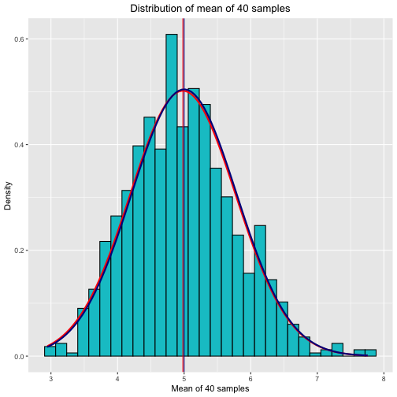

---
title: "Statistical Inference Project-Part 1"
author: "Shovit Bhari"
date: 2020-05-16
output: html_document
---


# Simulation Exercise Introduction

In this simulation, we will investigate the exponential distribution in R and compare it with the Central Limit Theorem. The exponential distribution can be simulated in R
with rexp(n, lambda) where lambda is the rate parameter. The mean of exponential distribution is 1/lambda and the standard deviation is also 1/lambda. Set lambda = 0.2 for all the simulations. We will investigate the distribution of averages of 40 exponentials and 1000 simulations. 


```r
library(ggplot2)
library(knitr)
knitr::opts_chunk$set(echo = TRUE, results = 'hold')
```

Set variables.

```r
set.seed(554)
lambda <- 0.2
n <- 40
nsim <- 1000
```

Create a matrix with 40 samples and 1000 simulations with the exponetial distribution. 

```r
simd<- matrix( rexp(n * nsim, rate= lambda), nsim)
dim(simd)
simmu <- rowMeans(simd)
```

```
## [1] 1000   40
```
Calculate the average across the 40 values for each of the 1000 simulations

```r
simmu <- rowMeans(simd)
```

## Mean Comparision
**Show the sample mean and compare it to the theoretical mean of the distribution.**  

##### Mean of Sample Means
Calculate the actual mean of sample data which is the average sample mean of 1000 simulations of 40 randomly sampled exponential distributions. 


```r
sammu <- mean(simmu)
sammu
```

```
## [1] 4.980725
```
\newpage

##### Theoretical Mean

```r
tmu <- 1/lambda
tmu
```

```
## [1] 5
```

The distribution of the mean of the sample means is centered at 4.9807255 and the theoretical mean is centered at5 and they are very close. 

## Variance Comparision
**Show how variable the sample is (via variance) and compare it to the theoretical variance of the distribution.**
##### Sample Variance
Calculate the actual variance

```r
samvar <- var(simmu)
samvar
```

```
## [1] 0.6318054
```

##### Theoretical Variance


```r
tvar <- (1/lambda)^2/n
tvar
```

```
## [1] 0.625
```

The variance of the sample means is 0.6318054 and the theoretical variance of the distribution is 0.625 and they are both close to each other. 

##### Sample Standard Deviation

```r
samsd <- sd(simmu)
samsd
```

```
## [1] 0.7948619
```


```r
tsd <- 1/(lambda * sqrt(n))
tsd
```

```
## [1] 0.7905694
```

The standard deviation of the sample means is 0.7948619 and the standard deviation of the theoretical means is 0.7905694 and both are close to each other. 

## Results
**Show that the distrubution is approximately normal.**

Visual represantation of the results, comparing sample values and the theoretical values. 


```r
data <- data.frame(simmu)
g <- ggplot(data, aes(x=simmu))
g <- g + geom_histogram(aes(y=..density..), colour="black", fill = "turquoise3") + 
         labs(title = "Distribution of mean of 40 samples", x ="Mean of 40 samples", y="Density")+
         theme(plot.title = element_text(hjust=0.5)) +
         geom_vline(xintercept = sammu, color ="red1")+ 
         geom_vline(xintercept = tmu, color ="darkblue") +
         stat_function(fun = dnorm, args = list(mean = sammu, sd = samsd), color = "red1", size = 1.0) +
         stat_function(fun = dnorm, args = list(mean = tmu, sd = tsd), color = "darkblue", size = 1.0)
g
```



The normal distribution of the actual data is shown with red lines which is approximately overlapped with theoretical with darkblue lines. 

The plot above clearly shows, the distribution of averages of 40 exponential distribution is close to the normal distribution with expected theoretical values based on the given lambda. 
#### Confidence Interval Comparision

##### Sample CI


```r
samCI <- round (mean(simmu) + c(-1,1)*1.96*sd(simmu)/sqrt(n),3)
samCI
```

```
## [1] 4.734 5.227
```

##### Theoretical CI

```r
tCI<- round(tmu + c(-1,1) * 1.96 * sqrt(tvar)/sqrt(n),3)
tCI
```

```
## [1] 4.755 5.245
```
The sample confidence interval 4.734, 5.227 and the theoretical confidence interval is 4.755, 5.245. The confidence levels also match closely. All the results clearly displays that the distribution is approximately normal. 

## Conclusion
Density plot above shows that the histogram is approximately normal. This satisfies the Central Limit Theorem, which states that as long as the sample size is large enough and all the samples are of the same size, then non normally distributed data is approximately normal. 
