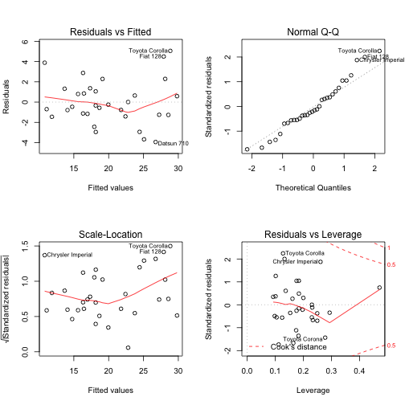
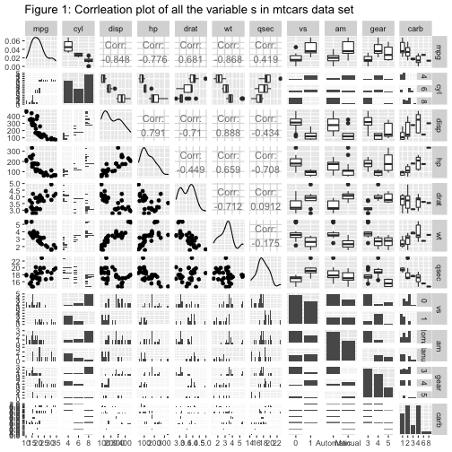
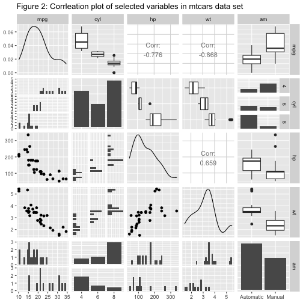
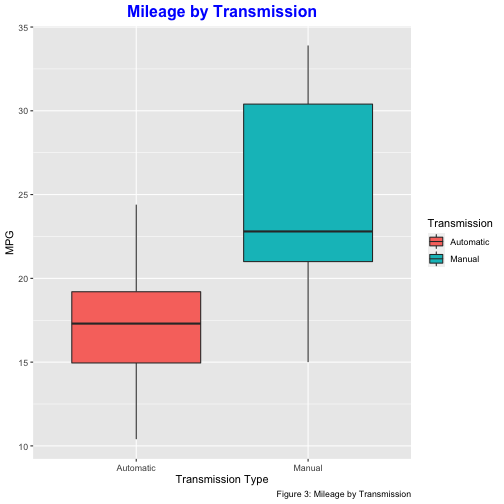
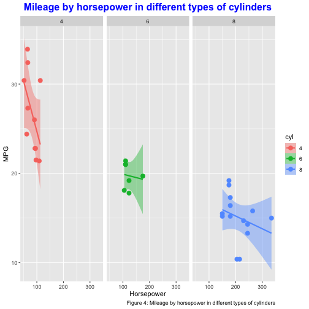

---
title: "Regression Model: Course Project"
author: "Shovit Bhari"
date: June 04 2020
output: html_document
---


## Executive Summary

This report is a course assignment of the Regression Models course on the Data Science Specialization by Johns Hopkins University on Coursera.

We estimate the relationship between **am** variable (type of transmission(automatic or manual)) and other independant variables, such as weight (**wt**), gross horsepower(**hp**), number of cylinders(**cyl**), and miles per gallon (**mpg**) variable is an outcome. 

We are particularly interested in the following two questions:

* Is an automatic or manual transmission better for **MPG**?
* Quantify the **MPG** difference between automatic and manual transmissions?

Our observatin from the analysis: 

* Manual transmission is better for **MPG** by a factor of **1.8** compared to automatic transmission. 
* Mean and medians of automatic and manual transmissions are significantly different.  


## Data Description
We analyze the ‘mtcars’ data set through Regression Modelling and exploratory analysis to show how automatic (am = 0) and manual (am = 1) transmissions features affect the MPG feature. The dataset “mtcars” is located in the package “datasets”.

The data set consists of 32 observations and 11 variables which are as following:

### Data processing

Set up the environment using the following code chunk

```r
library(datasets);library(ggplot2);library(GGally);library(knitr);library(dplyr)
```
### Data Preparation
Load the data and check the number of observations and variables. 


```r
data(mtcars); dim(mtcars)
```

```
## [1] 32 11
```


Transform necessay data into factors. 

```r
mtcars$cyl  <- factor(mtcars$cyl)
mtcars$vs   <- factor(mtcars$vs)
mtcars$gear <- factor(mtcars$gear)
mtcars$carb <- factor(mtcars$carb)
mtcars$am   <- factor(mtcars$am,labels=c("Automatic","Manual"))
```


## Exploratory Data Analysis

We explored the relationships between variables of interest. 
First, we plotted (Figure 1 in the Appendix) the relationsips between all the variables of the dataset. Corrleation plot, reflected that variables such as **cyl,disp,hp,wt**, and **am** have strong correlation with mpg. We plotted another plot (Figure 2 in the Appendix) with **cyl,disp,hp,wt**, and **am** variables. However, our main interest is effect of car transmission type with mpg, so we plotted boxplots of mpg with respect to transimmsion type (automtic or manual, Figure 3  in the Appendix)

### Regression Analysis
We built models based on different variables and tried to find the best model fit and compared it to the base model. 

#### Base Model(Model1): mpg vs. am


```r
model1 <- lm(mpg~am, data=mtcars)
summary(model1)
```

```
## 
## Call:
## lm(formula = mpg ~ am, data = mtcars)
## 
## Residuals:
##     Min      1Q  Median      3Q     Max 
## -9.3923 -3.0923 -0.2974  3.2439  9.5077 
## 
## Coefficients:
##             Estimate Std. Error t value Pr(>|t|)    
## (Intercept)   17.147      1.125  15.247 1.13e-15 ***
## amManual       7.245      1.764   4.106 0.000285 ***
## ---
## Signif. codes:  0 '***' 0.001 '**' 0.01 '*' 0.05 '.' 0.1 ' ' 1
## 
## Residual standard error: 4.902 on 30 degrees of freedom
## Multiple R-squared:  0.3598,	Adjusted R-squared:  0.3385 
## F-statistic: 16.86 on 1 and 30 DF,  p-value: 0.000285
```

#### Model2: mpg vs. am and cyl

```r
model2 <- lm(mpg~ am + cyl  , data=mtcars)
summary(model2)$r.squared
```

```
## [1] 0.7651114
```

#### Model3: mpg vs. am,cyl, and wt

```r
model3 <- lm(mpg~ am + cyl + wt , data=mtcars)
summary(model3)$r.squared
```

```
## [1] 0.8375127
```
#### Model4: mpg vs. am,cyl, wt, and hp

```r
model4 <- lm(mpg~ am + cyl + wt + hp , data=mtcars)
summary(model4)
```

```
## 
## Call:
## lm(formula = mpg ~ am + cyl + wt + hp, data = mtcars)
## 
## Residuals:
##     Min      1Q  Median      3Q     Max 
## -3.9387 -1.2560 -0.4013  1.1253  5.0513 
## 
## Coefficients:
##             Estimate Std. Error t value Pr(>|t|)    
## (Intercept) 33.70832    2.60489  12.940 7.73e-13 ***
## amManual     1.80921    1.39630   1.296  0.20646    
## cyl6        -3.03134    1.40728  -2.154  0.04068 *  
## cyl8        -2.16368    2.28425  -0.947  0.35225    
## wt          -2.49683    0.88559  -2.819  0.00908 ** 
## hp          -0.03211    0.01369  -2.345  0.02693 *  
## ---
## Signif. codes:  0 '***' 0.001 '**' 0.01 '*' 0.05 '.' 0.1 ' ' 1
## 
## Residual standard error: 2.41 on 26 degrees of freedom
## Multiple R-squared:  0.8659,	Adjusted R-squared:  0.8401 
## F-statistic: 33.57 on 5 and 26 DF,  p-value: 1.506e-10
```
After careful observation of four models, the adjusted $R^2$ for model 4 is approximately **0.87** which is the maximum compared to other models. This concluded that more than 87% of the variability is explained by model4. 

We analyzed one way variance for different models with **anova** function. However, **anova** for model1 and model4 is shown below.


```r
anova(model1, model4)
```

```
## Analysis of Variance Table
## 
## Model 1: mpg ~ am
## Model 2: mpg ~ am + cyl + wt + hp
##   Res.Df    RSS Df Sum of Sq      F    Pr(>F)    
## 1     30 720.90                                  
## 2     26 151.03  4    569.87 24.527 1.688e-08 ***
## ---
## Signif. codes:  0 '***' 0.001 '**' 0.01 '*' 0.05 '.' 0.1 ' ' 1
```
While comparing model1 and model4 **p-value** is significant. Thus, we reject the null hypothesis that the variables, **cyl**, **hp**, and **wt**, do not contribute to the accuracy of the model. 


## Residual and Diagnostics
We examined the residual plot of our best model and computed some of the regression diagnostics of our model to find outliers in the data set. 

```r
par(mfrow=c(2,2))
plot(model4)
```


From the above plots, we can make the following observations,

* The points in the Residuals vs. Fitted plot seem to be randomly scattered on the plot and verify the independence condition.
* The Normal Q-Q plot consists of the points which mostly fall on the line indicating that the residuals are normally distributed.
* The Scale-Location plot consists of points scattered in a constant band pattern, indicating constant variance.
* There are some distinct points of interest (outliers or leverage points) in the top right of the plots.

We computed some regression diagnostics of our model to find out these leverage points. We computed top three points in each case of influence measures.


```r
lev <- hatvalues(model4)
tail(sort(lev),3)
```

```
##       Toyota Corona Lincoln Continental       Maserati Bora 
##           0.2777872           0.2936819           0.4713671
```

```r
inf <- dfbetas(model4)
tail(sort(inf[,2]),3)
```

```
## Chrysler Imperial          Fiat 128     Toyota Corona 
##         0.3507458         0.4292043         0.7305402
```
## Inference

We perfomed a **t.test** with the assumtion that the transmission data has a normal distribution. As per the result, the manual and the automatic transmissions are significantly different. 


```r
t.test(mpg~am, data=mtcars)
```

```
## 
## 	Welch Two Sample t-test
## 
## data:  mpg by am
## t = -3.7671, df = 18.332, p-value = 0.001374
## alternative hypothesis: true difference in means is not equal to 0
## 95 percent confidence interval:
##  -11.280194  -3.209684
## sample estimates:
## mean in group Automatic    mean in group Manual 
##                17.14737                24.39231
```

## Conclusion
After carefully analyzing the data, here's our observation from the best fit model.


* Cars with the **manual** transmission gets more mileage than the **automatic** transmission which is by the factor of **1.8**. 
* **mpg** will decrease by **2.5** for every **1000 lb** increase in wt. 
* Decrease in **mpg** is negligible with increaseof **hp**
* When the number of cylinders (**cyl**) increases from **4** to **6** and **8**, **mpg** will decrease by the factor of **3** and **2.2**.

## Appendix:











